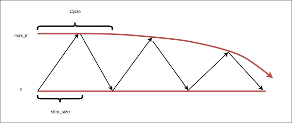
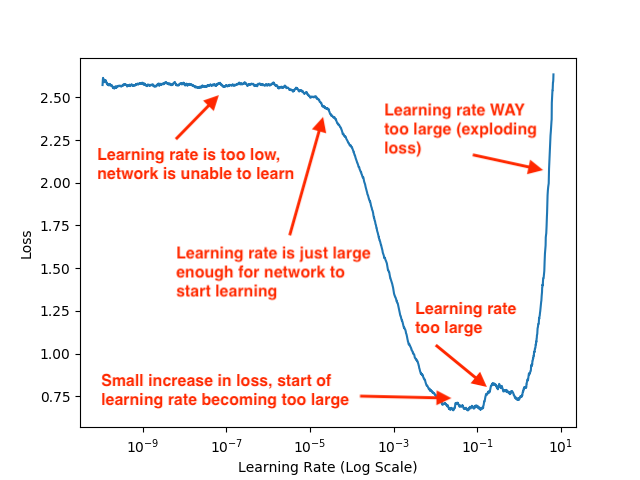

# flower_classification

## Travail fait par Belkassa Said et moi même Reguigui Yassine

Exercice en classe de Deep Learning :

1- Choisir une compétition sur Kaggle

2- Prendre le code d'un des participants, de préference utilisant pytorch mais n'importe quelle bibliothèque de DL est acceptée

3- Créer repo Github contenant :
  * Readme avec le contexte de la compétition, les données et les difficultés rencontrées
  * Notebook commenté, expliqué
  * Noter les "astuces"
  
  
Compétion choisie : https://www.kaggle.com/nachiket273/flower-classification-lookahead-radam

## Données et contexte compétition

Cette compétition a été créée par Udacity pour avoir un classement ( officieux ) du Udacity PyTorch FB Challenge.
Nous avons un dataset consistant de 102 categories de fleurs differentes.
Nous avons :
- Dossier train contenant 102 dossiers pour chacune des classes de fleurs. Chaque dossier a entre 40 et 258 images
- Dossier valid contenant 102 dossiers pour chacune des classes de fleurs
- Dossier test contenant 819 images pour la submission de la compétition
- Fichier cat_to_name.json avec comme clé le numéro du dossier/classe et comme valeur le nom de la classe/fleur

## Astuces

- Cyclic Learning Rate ( CLR ) 
https://arxiv.org/abs/1506.01186

Le CLR est un technique qui permet de trouver le meilleur Learning rate :

 1- On définit le minimum ou base de notre Learning rate appelé : base_lr
 2- On définit le maximum de notre Learning rate appelé : max_lr
 3- On fait osciller le Learning Rate entre base_lr et max_lr jusqu'à ce que la loss explose
 
 

